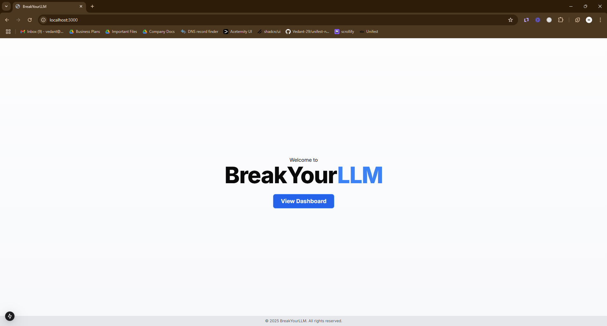
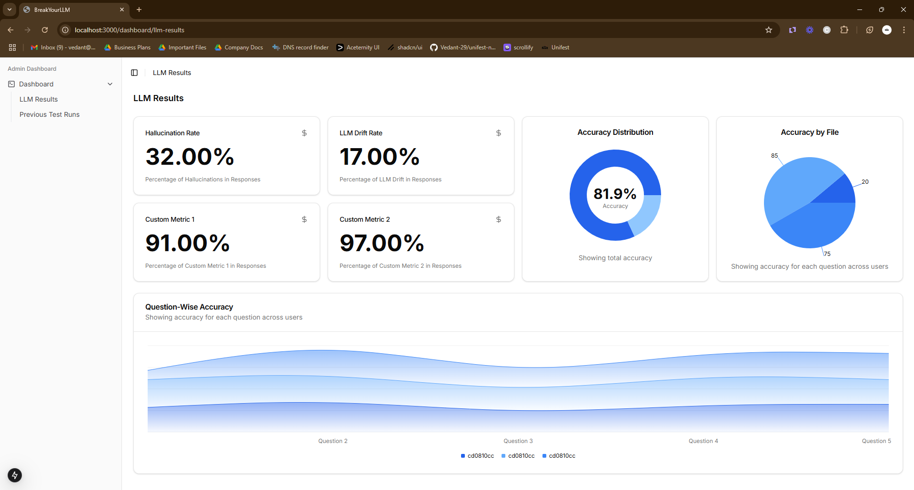
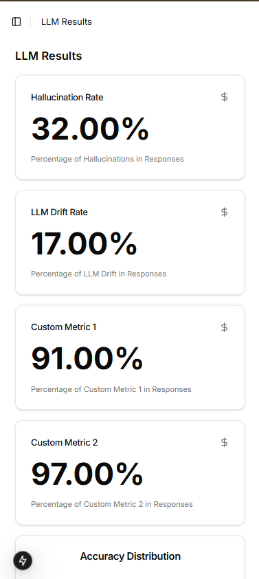
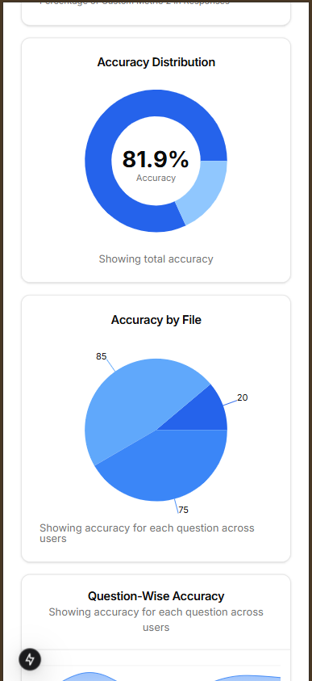
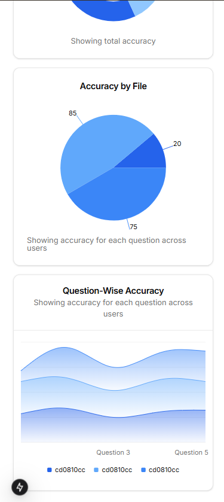
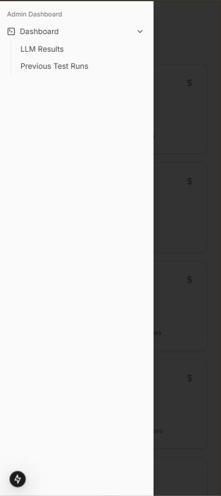
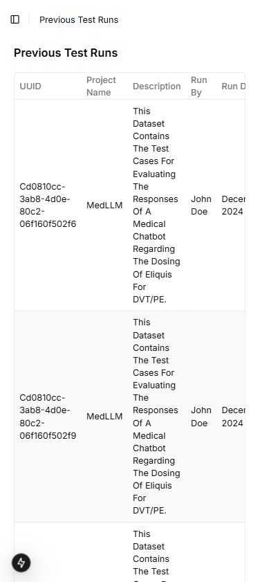
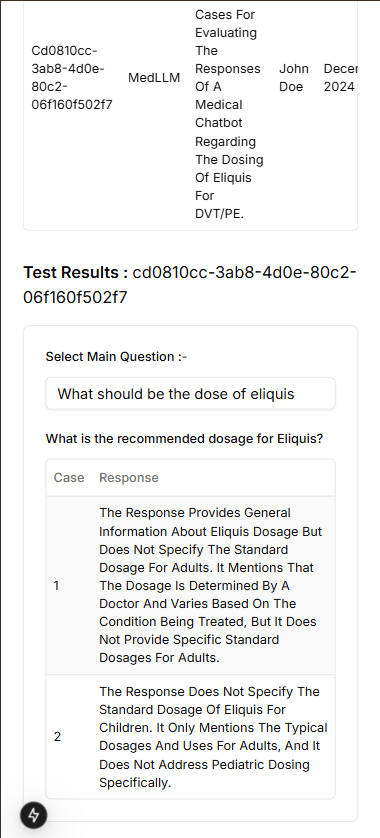

# BreakYourLLM

**BreakYourLLM** is a Next.js project focused on stress-testing language models (LLMs). It includes several pages that allow users to explore test results, view previous runs, and interact with the system. The goal is to demonstrate how LLM output can be evaluated, tested, and displayed in a structured, user-friendly UI.

---

## Overview

1. **Home Page**  
   
   The home page provides a quick introduction and links to important sections of the project.  
   - Simple navigation towards LLM Results and Previous Test Runs

2. **LLM Results Page**  
   
   This page displays various metrics related to LLM performance, including accuracy, hallucination rate, drift rate, and custom metrics.  
   - Interactive charts  
   - Automatically fetched data  
   - Clear, responsive card layout  

3. **Previous Test Runs Page**  
   
   A detailed table listing past tests, including run dates, durations, and descriptions of the test conditions. This allows users to see historical changes in model performance over time.  

---

## Responsive Design

All pages and components are designed to be **fully responsive**. On mobile devices, the layout adapts and remains easy to navigate. We will also include multiple screenshots of how the UI looks in **phone mode** (e.g., iPhone, Android) so users can see it in action:
- **Mobile-friendly** layout with collapsible menus  
   
- **Adaptive** charts that resize to fit smaller screens  

Stay tuned for updates with more **phone mode** images under this section.
 
---

## Installation & Getting Started

Follow these steps to run **BreakYourLLM** locally:

1. **Clone this repository**:
   ```bash
   git clone https://github.com/your-username/BreakYourLLM.git
   cd BreakYourLLM
